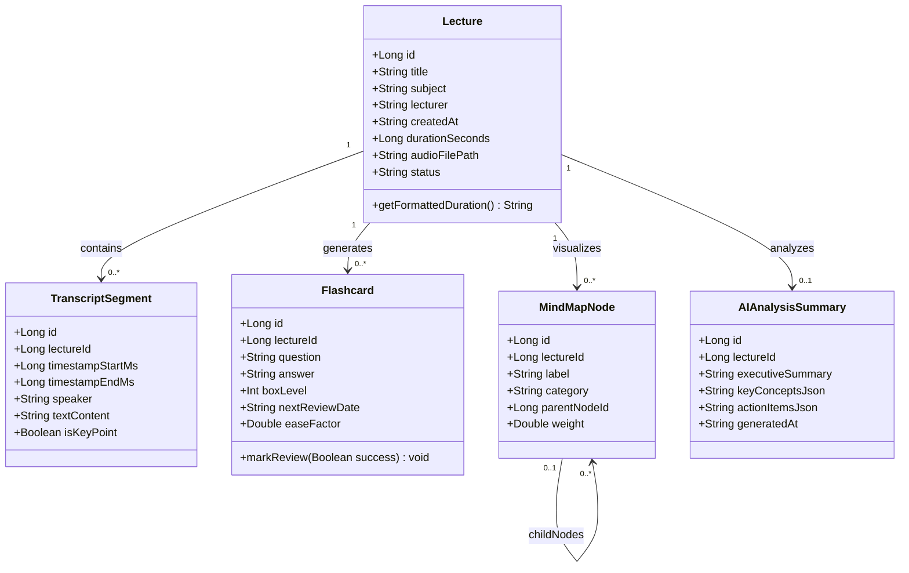

# Klase-Diagrama (Mermaid Testu Formatuan)

Metodologiaren arabera (Slide 3 eta 9), motak, erlazioak eta kardinalitateak testu-formatuan zehazten dira inolako anbiguotasunik gabe.

```mermaid
classDiagram
    direction TB

    class Lecture {
        +Long id
        +String title
        +String subject
        +String lecturer
        +String createdAt
        +Long durationSeconds
        +String audioFilePath
        +String status
        +getFormattedDuration() String
    }

    class TranscriptSegment {
        +Long id
        +Long lectureId
        +Long timestampStartMs
        +Long timestampEndMs
        +String speaker
        +String textContent
        +Boolean isKeyPoint
    }

    class Flashcard {
        +Long id
        +Long lectureId
        +String question
        +String answer
        +Int boxLevel
        +String nextReviewDate
        +Double easeFactor
        +markReview(Boolean success) void
    }

    class MindMapNode {
        +Long id
        +Long lectureId
        +String label
        +String category
        +Long parentNodeId
        +Double weight
    }

    class AIAnalysisSummary {
        +Long id
        +Long lectureId
        +String executiveSummary
        +String keyConceptsJson
        +String actionItemsJson
        +String generatedAt
    }

    Lecture "1" --> "0..*" TranscriptSegment : contains
    Lecture "1" --> "0..*" Flashcard : generates
    Lecture "1" --> "0..*" MindMapNode : visualizes
    Lecture "1" --> "0..1" AIAnalysisSummary : analyzes
    MindMapNode "0..1" --> "0..*" MindMapNode : childNodes
```
